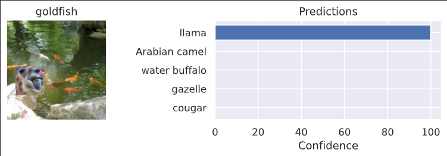
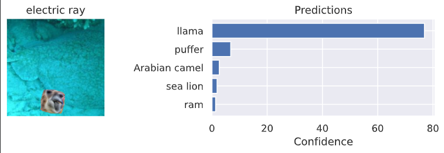
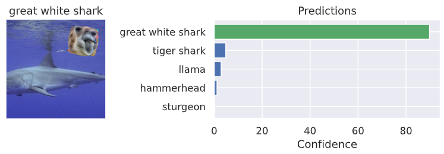
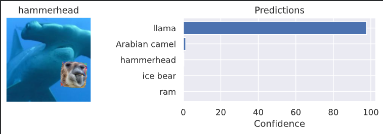
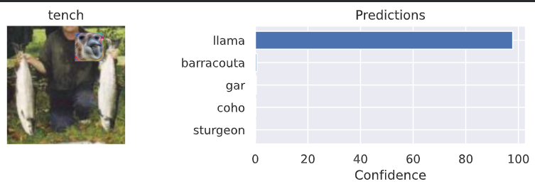
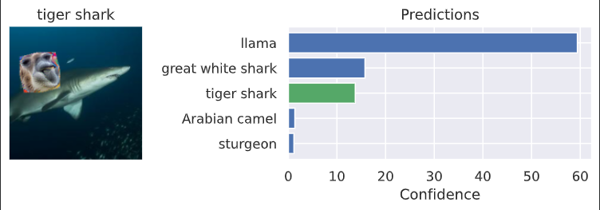

# Adversarial-Patches

## Project Description
This project implements a robust adversarial patch attack against a ResNet-34 model. The notebook contains the complete PyTorch code to train a 64x64 patch from scratch that, when placed on any image, deceives the classifier into predicting the target class 'Llama'. To ensure real-world effectiveness, the patch is trained to be robust to transformations by applying random rotations (±20°) and scaling (75%-125%) during the training loop - all in order to achieve a high 'fooling' accuracy.

## Trained Llama Patch

## Results
The patch successfully fools the model into predicting "llama" when applied to various test images, but obviously, with occasional limitations

| Original: 'goldfish' | Original: 'electric_ray' | Original: 'great_white_shark' |
| :---: | :---: | :---: |
|  |  |  |
| **Original: 'hammerhead'** | **Original: 'tench'** | **Original: 'tiger_shark'** |
|  |  |  |

## Running the Project 
Please use Google Co-lab. Select A100 GPU preferred for a resonable runtime 

